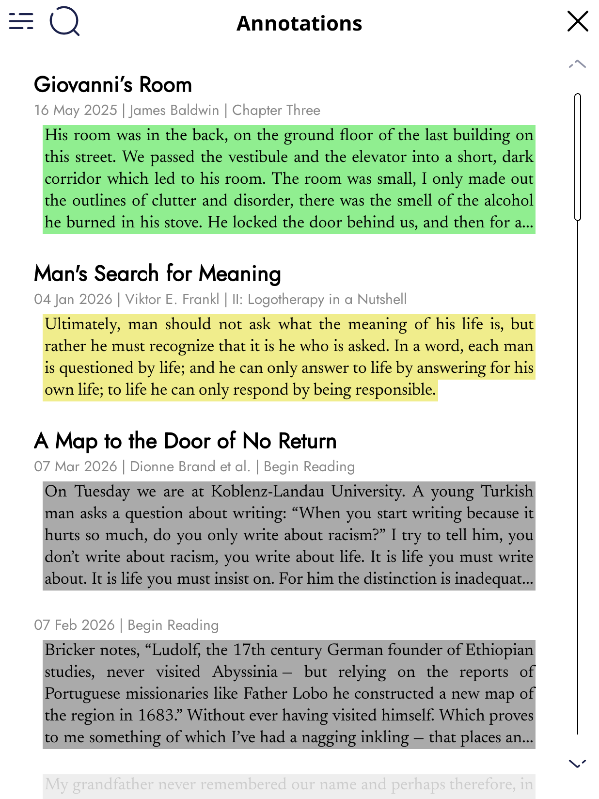
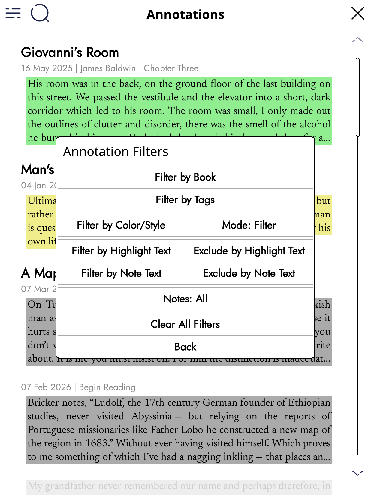
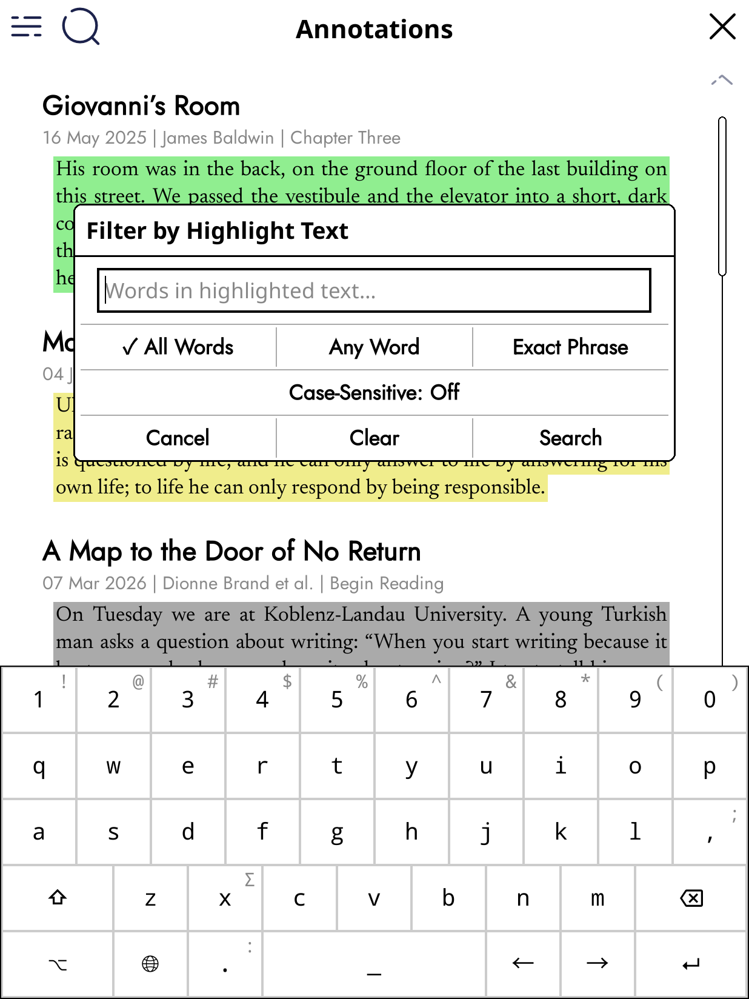
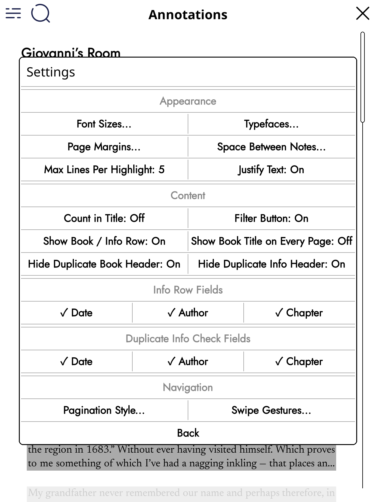

# Annotations Viewer (All Notes & Highlights) Plugin for KOReader

This plugin scans KOReader's stored annotations (highlights and notes) and provides a single unified interface to browse, filter and manage them across all books you've read.

Key behaviors:
- Aggregates highlights and notes from KOReader
- Shows book title, date, chapter, highlighted text and any user note for each annotation
- Lets you open the source book at the annotated location
- Edit or delete annotations, change highlight style or color
- Extensive annotations filtering system enabling filtering by highlight color, style, books,tags, chapters, words in highlights and notes using inclusion and exclusion
- Caching annotations for faster loading
- Configure font sizes, margins, truncation length and many more display options from the plugin Settings menu for lots of customization

## Features

- Unified view of all annotations across books
- Pagination for long annotation lists
- Pagination customisation
- Filter by highlight color, style (underline/strikeout/invert/lighten), book titles, tags, highlight text, note text using inclusions and/or exclusions
- Edit note text in-place and save back to the book's settings
- Change highlight style and color and save back to book settings
- Delete annotations
- Go to the highlighted location in the reader
- Customize fonts, margins, truncation and many other options

## Usage

1. Open KOReader.
2. From the file cabinet menu or within a book select `Annotations`.
3. Browse the list of annotations. Tap an item to view details and access actions:
   - Open book at annotation
   - Edit note text
   - Change highlight style or color
   - Delete annotation

Use the plugin Settings (accessible from the plugin menu) to adjust fonts, font sizes, margins,and other display preferences.

## Screenshot

